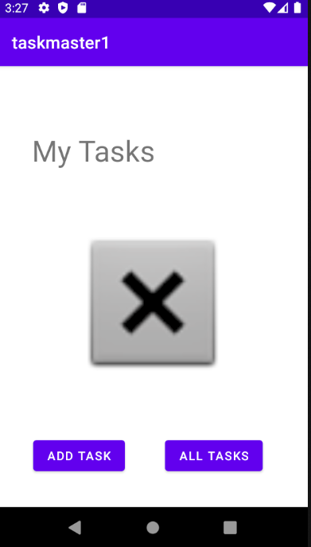

# taskmaster

An app designed to create and track tasks and mark their completion. Still in development

## Changelog

### 4.26.21

- added homescreen with link to addTask and allTasks

- addTask has a submitable form that saves task info and says submitted when button is pressed.

- allTasks displays a title and image

## Attributions

- https://stackoverflow.com/questions/5756136/how-to-hide-a-view-programmatically