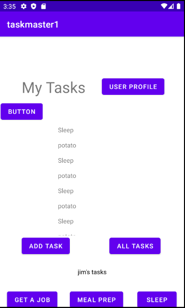

# taskmaster

An app designed to create and track tasks and mark their completion. Still in development

## Screenshot

## Changelog

### 4.29.21

- add task saves to local db

- home page recycle view displays all Task entities from db

- tapping on task takes to task details page with info from db

### 4.28.21

- added hard coded recyclerview to homescreen displaying tasks and links to task details page

- added task model with title, body and state with methods for changing state

- added return home button to confirm update of username works correctly

### 4.27.21

- added links to hardcoded tasks: get a job, meal prep, sleep which take in the title of the button and display on task details page

- added simple unit test for add tasks page

- added usersettings page and link which stores and displays username on home page

### 4.26.21

- added homescreen with link to addTask and allTasks

- addTask has a submitable form that saves task info and says submitted when button is pressed.

- allTasks displays a title and image

## Attributions

- https://stackoverflow.com/questions/5756136/how-to-hide-a-view-programmatically