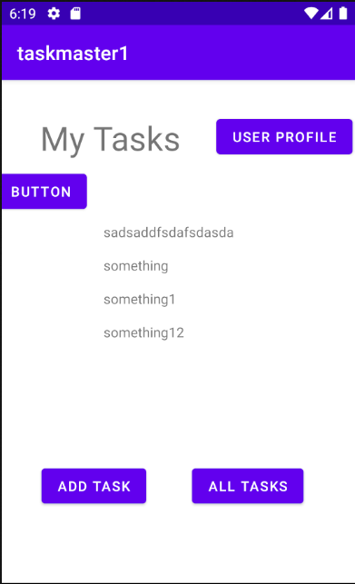

# taskmaster

An app designed to create and track tasks and mark their completion. Still in development

## Screenshot

## Changelog

### 5.18.21

- location permission request upon opening app

- location added to task schema

- location included in task if given permission

- 

### 5.17.21

- implement intent filters

- user can share images to task details

- button indicates if image is already selected

### 5.13.21

- implement pinpoint for user analytics

### 5.12.21

- implement firebase cloud messaging

### 5.11.21

- add task now accepts an image as an optional input

- task details now displays an image if there's one associated with the task

- implement s3 storage using amplify

### 5.10.21

- cognito auth implemented

- user can sign up, in and log out

- logout button hidden when not signed in

- login and signup button hidden when signed in

### 5.06.21

- homepage shows tasks assigned to user's team or all tasks if they haven't selected a team

- add task properly assigns tasks to the designated team

- deployed first release to google play

- populated app description and images

- completed rating questionaire

- invited testers

### 5.05.21

- tasks now belong to teams

- user can select which team they are on and preference is saved

- user can select which team a task is for

### 5.04.21

- amplify initialized

- taskschema created and pushed

- adapt addTask activity to dynamodb

- adapt homescreen recyclerView to display dynamodb tasks

- adapt adapter to provided build requirements for dynamodb and graphql

### 5.03.21

- test main ui functionality

- test update username

- test task details title transfer

### 4.29.21

- add task saves to local db

- home page recycle view displays all Task entities from db

- tapping on task takes to task details page with info from db

### 4.28.21

- added hard coded recyclerview to homescreen displaying tasks and links to task details page

- added task model with title, body and state with methods for changing state

- added return home button to confirm update of username works correctly

### 4.27.21

- added links to hardcoded tasks: get a job, meal prep, sleep which take in the title of the button and display on task details page

- added simple unit test for add tasks page

- added usersettings page and link which stores and displays username on home page

### 4.26.21

- added homescreen with link to addTask and allTasks

- addTask has a submitable form that saves task info and says submitted when button is pressed.

- allTasks displays a title and image

## Attributions

- https://stackoverflow.com/questions/5756136/how-to-hide-a-view-programmatically